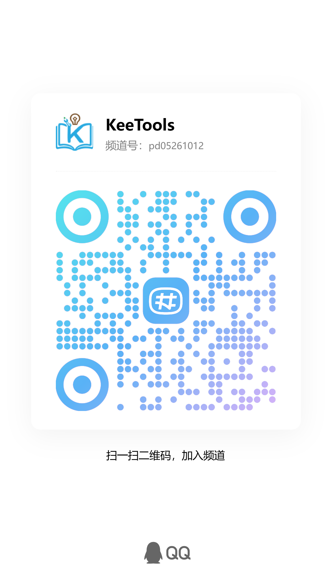
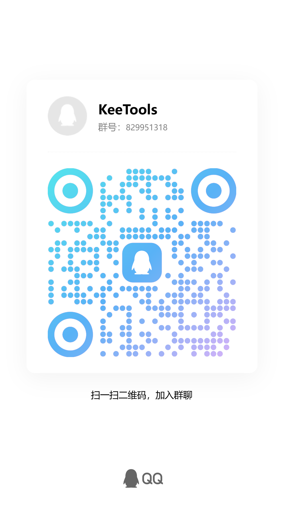

# KeeTools · 课工具 — 免费离线课堂工具集

> **离线优先**的 K12 课堂工具集：每个工具就是一个 HTML 文件，下载即用、U盘即插即用、
> 断网照常上课；不下载也可在[在线站](https://keetools.ztsite.com)应急使用。
> 只做工具，不做题库。中文名：**课工具**；英文名：`KeeTools`
>
> **当前状态**：58 个工具，覆盖通用 / 语文 / 数学 / 英语 / 物理 / 化学 / 生物 / 历史 / 地理 / 科学 / 信息技术
> 协议：**AGPL-3.0**，欢迎社区共建（见[参与指南](CONTRIBUTING.md)）

---

## 为什么是离线单文件

老师需要的课堂工具（随机点名、大转盘、倒计时、计分板、学科教具……）通常散落在各种网站：
要么被广告包围，要么要注册，要么——**教室断网就全废了**。

KeeTools 的答案：**每个工具 = 一个独立目录，尽可能打包为单个 HTML 文件**——双击就能用，断网也能用；
个别需要大素材的大型工具允许附带 `assets/` 资源目录，离线合集包整目录分发。

- 📦 **U盘即插即用**：拷进 U 盘，教室一体机双击就开，无需安装、无需账号
- 📄 **单文件优先**：工具尽可能压缩为单个 HTML；做不到时按目录分发（离线包整目录打包）
- 🔌 **断网可用**：上课不赌网络，离线合集包一次打包全校共用
- 🔒 **数据存本地**：学生名单、成绩只留在自己电脑，不上传任何服务器
- 🖥️ **为大屏设计**：投影 1024×768 与一体机 1920×1080 都适配，字够大
- 🧩 **学科教具**：不只是点名计时——物理实验仿真、几何函数、细胞结构、拼音笔顺、地图时间线
- 🆓 **完全免费**：AGPL-3.0 开源，代码透明，欢迎审计

---

## 在线使用

| 入口 | 地址 |
|---|---|
| 在线站（应急使用 / 最新版本） | [keetools.ztsite.com](https://keetools.ztsite.com) |
| 工具详情页 | `https://keetools.ztsite.com/tool/{tool-id}` |

在线站与离线工具完全同源：在线页是工具本体的 iframe，下载的单文件与离线包**不经任何在线流程**，绝对干净。

---

## 写在前面

> 这个项目由 **AI 辅助构建**，站长并非程序员出身。它的诞生很简单：一位教师朋友在课堂上
> 总是用到这类小工具，而网上的工具不是夹着广告、要注册，就是断网就废——于是有了 KeeTools。
>
> 开发过程中必然存在许多不足与疏漏，**诚恳欢迎各路专业同学提出建设性建议、提交修复与改进**——
> 哪怕只是指出一个错别字、一个不规范的写法，都是对这个项目实实在在的帮助。
> 见 [CONTRIBUTING.md](CONTRIBUTING.md)。

---

## 交流社区

加入频道 / 群，获取工具更新通知、提需求、和其他老师交流用法：

| QQ 频道 | QQ 群 |
|---|---|
|  |  |

---

## ☕ 请喝一杯奶茶

所有工具**永久免费**，也不会有广告。如果你觉得它帮到了你的课堂，欢迎请站长喝一杯奶茶——
这是项目持续更新的全部动力。

| 微信 | 支付宝 |
|---|---|
|  |  |

> 金额随意，心意最重要。赞助者可在[在线站赞助页](https://keetools.ztsite.com/sponsor)留言进入鸣谢名单。

---

## 自行部署（自建站点 / 校内网）

```bash
git clone https://github.com/adream2/KeeTools.git
cd KeeTools
cp .env.example .env        # 按注释修改，生产环境注意文件末尾的自检清单
php scripts/init_db.php      # 初始化 SQLite（WAL）
git config core.hooksPath .githooks
php -S 127.0.0.1:8000 -t public public/router.php
```

- Web 根指向 `public/`；工具放入 `tools/` 目录后**自动上架**（manifest 有改动自动重扫，目录移除自动下架）
- 生产要求：PHP 8.0+（pdo_sqlite、zip），详见 `.env.example` 末尾自检清单
- 后台入口：`/admin`（不在前台页面暴露入口链接）

---

## 参与共建

工具开发是繁琐的事，一个人做不完——这正是这个仓库存在的理由。

| 你可以 | 从这里开始 |
|---|---|
| 提需求 / 报 Bug | [Issues](../../issues/new/choose) |
| 写一个新工具 | [教程：做一个课工具](docs/教程-做一个课工具.md)（手把手全流程） |
| 改进共享逻辑 | `tools/_shared/`（改一处，全部工具受益） |
| 完善文档 / 教程 | 直接 PR |

PR 提交后 CI 会自动跑全部质量门禁（manifest 一致性 / 零 CDN 依赖 / 共享逻辑同步 / CSS 令牌 / 产物最新），
人工只审**教学适用性**与素材版权。期待你的第一个 PR。

---

## 目录导航

| 目录 | 说明 |
|---|---|
| `public/` | **唯一 Web 根**，对外暴露的入口与静态资源 |
| `src/` | PHP 源码（core 框架 / admin 后台 / frontend 前台 / services 服务） |
| `assets-src/` | 需要构建的源资源（CSS 源、图标清单） |
| `tools/` | 工具本体（58 个），每个工具一个目录；`_shared/` 为共享逻辑源 |
| `scripts/` | Python 工程脚本（门禁 / 构建 / 脚手架） |
| `docs/` | 开发规范（工具 / manifest / 编码 / 安全 / 图标） |

## 许可证

- 项目代码与工具：**[GNU AGPL-3.0](LICENSE)**
- 第三方素材（Lucide / Tabler 图标、拼音音频、汉字笔顺数据）：
  见 [`THIRD-PARTY-LICENSES.md`](THIRD-PARTY-LICENSES.md) 与[在线站关于页](https://keetools.ztsite.com/about)
